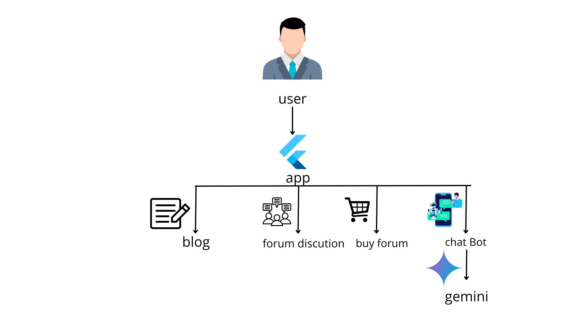

# ReGreenAI 🌱

**Empowering Farmers with AI and Community**

---

## 📷 App Logo

**`**

---
## 🧱 System Architecture
**`**
---

## 🧑‍🌾 Overview

Farming today can be tough. Many farmers face challenges such as:
- Unpredictable weather
- Limited access to reliable information
- Difficulty connecting with markets and fellow farmers

**ReGreenAI** is a mobile app built to support farmers in their daily activities. It's simple, helpful, and easy to use — designed with real farming challenges in mind.

---

## 📱 Features

### 🤖 AI Chatbot Support
Get instant help from our AI-powered chatbot. Ask questions about:
- Crops
- Pests
- Fertilizers
- Farming techniques
- And more

### 💬 Forum Discussion
Connect with other farmers to:
- Share experiences
- Ask for advice
- Learn new techniques
- Build a farming community

### 🔄 Forum Trade
Easily buy, sell, or trade farming tools and products within the community.

### 🌾 Farming Recommendations
Personalized suggestions based on your:
- Location
- Seasonal patterns
- Crop preferences  
Know **what to plant** and **when to plant**.

### 🌤️ Weather Updates
Stay informed with the latest weather forecasts to make smarter farming decisions.

---

## ❤️ Made for Farmers
ReGreenAI is built **for farmers**, by people who care about agriculture and sustainability. We aim to empower farming communities through technology, information, and connection.

---

## 🚀 Getting Started
Coming soon...

---

## 👥 Contributors

| Role | Name                  | GitHub                                             | Profile Picture                            |
|------|-----------------------|----------------------------------------------------|---------------------------------------------|
| 👑 Lead | I Gede Agus Supartana | [@Teslakw](https://github.com/Teslakw) |  |
|------| I Putu Willy Nugraha | [@Lincosin](https://github.com/Lincosin)     |  |

---

> Together, let's grow a better future with ReGreenAI. 🌾🌱
